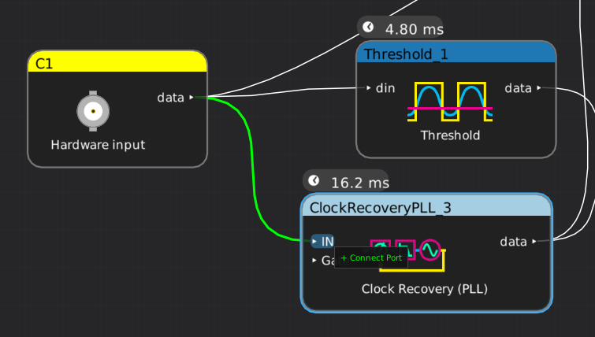

# Interactive filter graph design

Easily create complex analysis setups by chaining processing blocks together. There's no distinction between instrument channels, protocol decodes, or math functions - freely combine them any way you want.

Draw lines with the mouse to connect existing blocks.

Draw a line to a blank area of the canvas to make a new block.

Right click on a block to configure it.

# Extensibility

Need a decode for an obscure or proprietary protocol that's not in the library? Build it yourself!

A new filter block is a single C++ class which can chain before and after existing blocks. No need to start from raw analog samples - you can take SPI bus transactions, PCIe TLPs, 8B/10B symbols, Ethernet frames, or any other supported data type as input. If your new decode outputs a standard data type, it can be used as input to existing library blocks as well.

Filter blocks can be loaded from binary plugins, allowing easy distribution of filters without needing to build a custom version of libscopehal from source every time you install a new decode.

The QSGMII protocol decode shown here took less than a day of engineering time to develop due to this ability to leverage existing decodes, and the [source code](https://github.com/ngscopeclient/scopehal/blob/master/scopeprotocols/QSGMIIDecoder.cpp) was under 175 lines including comments. It accepts a single 5 Gbps 8B/10B stream and outputs four demuxed 1.25 Gbps 8B/10B streams which can be used as input to the existing SGMII decode.

