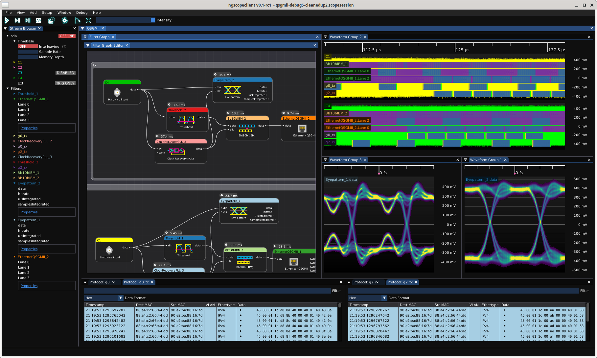

# Streamline hardware test

* Drag and drop to create complex, GPU-accelerated analysis pipelines in the [filter graph editor](/grapheditor)
* [Open source](https://www.github.com/ngscopeclient/scopehal-apps) toolchain supporting Windows, Linux, and MacOS
* Easily extensible to support any T&M instrument with a SCPI interface or native API
* Combine [multiple instruments](/multiscope) into a unified test platform
* Automate production test with the [C++ API](/devdocs)
* Analyze [complex protocols](/protocol-analysis) such as Ethernet and PCIe

<figure>

<figcaption style='font-style:italic'>Using ngscopeclient to do protocol decoding and signal integrity analysis of a 5 Gbps QSGMII link</figcaption>
</figure>

# News

* 2025-12-31: [Version 0.1.1 released](/news/2025-12-31-v0p1p1-release.html)
* 2025-09-11: [Version 0.1 released](/news/2025-09-11-v0p1-release.html)

# Download

The latest binary release can be found [on GitHub](https://github.com/ngscopeclient/scopehal-apps/releases/)

For build and installation instructions, please refer to the "Getting Started" chapter of the User Manual:

* [User Manual, Getting Started (HTML)](/manual/GettingStarted.html)
* [User Manual (PDF)](/downloads/ngscopeclient-manual.pdf)

# Learn more

* [Get involved](/getinvolved)
* [Supported hardware](/hardware)
* [User manual (HTML)](/manual/contentsname.html)
* [User manual (PDF)](/downloads/ngscopeclient-manual.pdf)
* [Developer API documentation](/devdocs)
* [ngscopeclient organization on GitHub](https://github.com/ngscopeclient)
