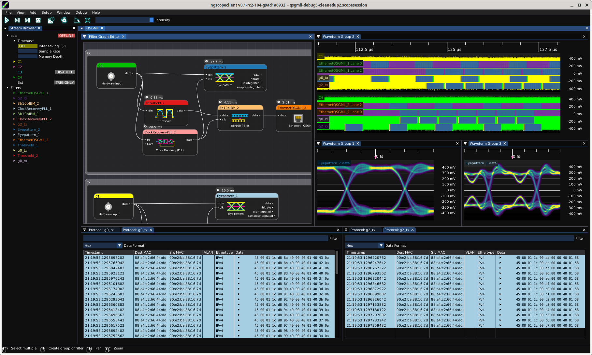

# Streamline hardware test

* Drag and drop to create complex, GPU-accelerated analysis pipelines in the filter graph editor
* [Open source](https://www.github.com/glscopeclient/scopehal-apps) toolchain supporting Windows, Linux, and MacOS
* Easily extensible to support any T&M instrument with a SCPI interface or native API
* Combine multiple instruments into a unified test platform
* Automate production test with the C++ API

<figure>

<figcaption style='font-style:italic'>Using ngscopeclient to do protocol decoding and signal integrity analysis of a 5 Gbps QSGMII link</figcaption>
</figure>

# Learn more

* [Get involved](/getinvolved)
* [Supported hardware](/hardware)

# Advanced topics

* [Multi-scope support](/multiscope)
