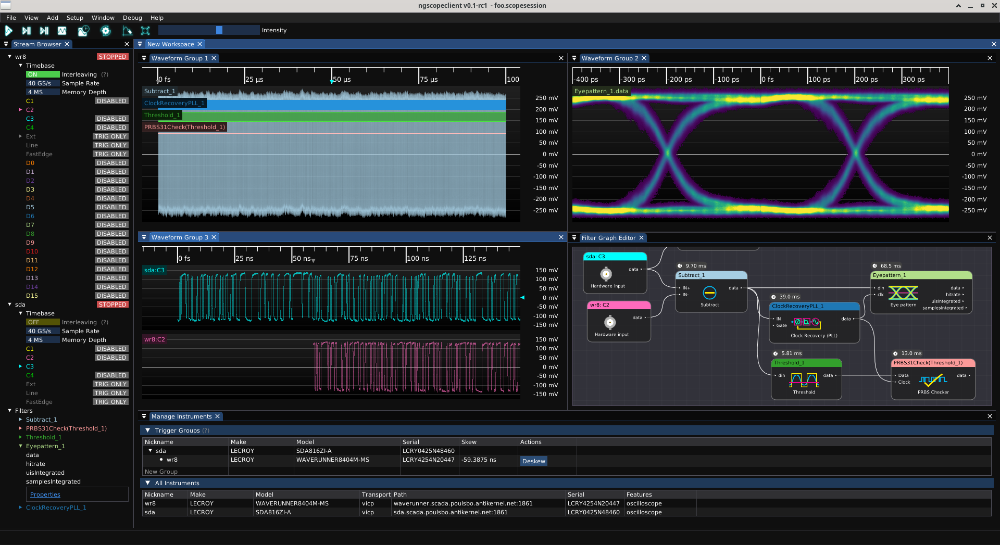

# Multi-scope support

Ngscopeclient allows a single session to connect to arbitrarily many oscilloscopes simultaneously. These instruments can be fully independent of each other (triggering with no relationship to the others) or grouped into "trigger groups", via a cross-trigger sync cable, allowing several instruments to trigger in lock-step.

Any number of oscilloscopes, of any supported make or model, may be combined in the same trigger group. Sample rates need not be the same, and the horizontal positions of each instrument within a group may be adjusted independently. This allows complex analytical setups for study of behavior across varying time scales:

* Use a high speed oscilloscope to identify packets or signal integrity issues in a gigabit serial signal, then trigger a low-speed instrument recording tens or hundreds of ms of activity on status GPIOs, MDIO or I2C buses, etc. before and after the high speed events
* Combine multiple instruments to capture data on more channels than a single instrument can support
* Use two or more instruments to capture cause-and-effect pairs on different channels separated by arbitrarily long time periods, while displaying on a single timeline

An automated deskew wizard allows the cross-trigger path delay within a trigger group to be measured and calibrated out, so that waveforms from all oscilloscopes in the group will line up correctly on the timeline.

Protocol decodes, math functions, and filter blocks can work across inputs from multiple instruments. Most math functions require their inputs to be sampled at the same rate, so you may need to use a resampling block if the instruments are not configured identically. Most protocol decode blocks can work with inputs of different sample rates without issue as long as the deskew calibration has been performed.
