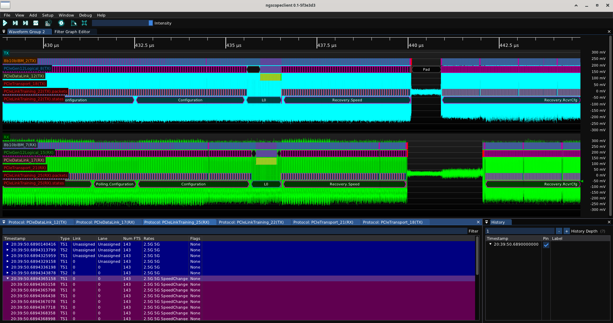
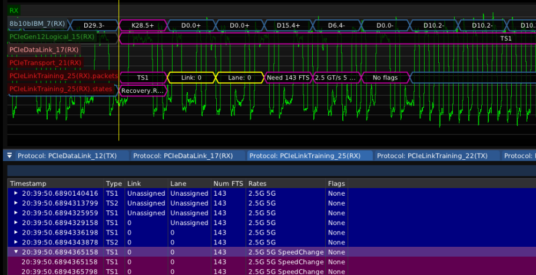
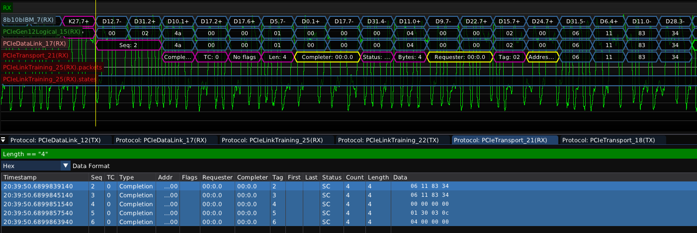

# Protocol Analysis

Combine waveform-centric and packet-centric decode views to better understand complex system behavior.

In the example below, a PCIe gen2 x1 link comes up at 2.5 GT/s then negotiates a transition to 5 GT/s speed.

Zooming in, a single TS2 training set can be seen in the waveform view, decoded at several levels. A list of packets is displayed in the protocol analyzer view below the waveform. Complex transactions or sequences of repeated packets are collapsed into a single line item unless expanded, allowing quick understanding of long captures.

Clicking on a packet in the protocol analyzer moves the waveform view to make the packet visible, and moves the X-axis cursor (if enabled) to the start of the packet. Dragging the cursor highlights the packet under the cursor in the protocol analyzer view.

The protocol analyzer view supports complex filter expressions, allowing packets of interest to be quickly located among thousands of irrelevant ones.

